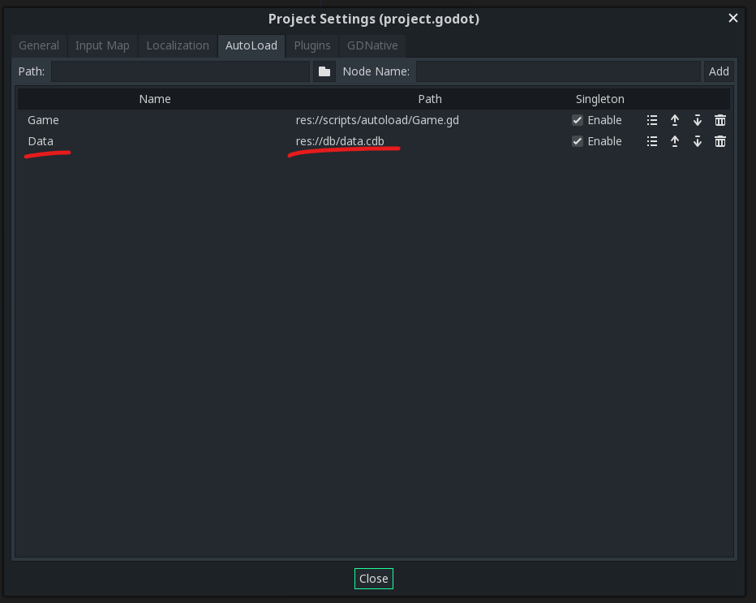
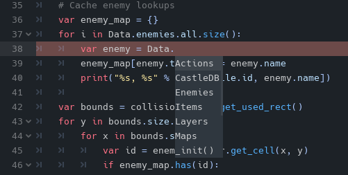

# castledb-godot
This is a plugin for [Godot 3](https://godotengine.org/) to import [CastleDB](http://castledb.org/) database files as static data in gdscript with autocomplete.

## Installation
Clone this repository and copy the contents of `addons` to your own project's `addons` folder.

Enable the plugin in the Project Settings.

Add a CastleDB file somewhere in your project hierarchy. Your CastleDB file must use the `.cdb` extension for the importer to generate code.

Add the imported CastleDB file to your AutoLoad scripts in Project Settings.



Enjoy code completion of your static data!



## Usage Notes
- Use lowercase names for your sheets as the type is simply generated from Capitalizing your sheet names.
- String name constants are generated per sheet for your Unique Identifier columns
- Lookup your rows using the Unique Identifier for that sheet i.e. `Data.sheetname.get(Data.SheetName.UniqueId)`. This lookup is hashed and fast.
- Iterate your rows using the `all` field and for better autocompletion use the `get_index()` function when retreiving a row while iterating. i.e.
    ```swift
    for i in Data.sheetname.all.size():
            var item = Data.sheetname.get_index(i)
    ```
- If in doubt look at the generated script data by simply opening the `.cdb` file in Godot's script editor. *You may need to open the file in an extenral editor from it's imported source in the `.import` folder due to  limitation of Godot when re-importing / saving your CDB file as the editor seems to cache the original source, however from my experience autocompletion and testing still works without an editor restart.*

## Currently Supported Types
 - ID
 - Bool
 - Int
 - Float
 - Enumeration
 - Color
 - String
 - File
 - Tile

## Disclaimer
This project is driven entirely by my use of CastleDB in personal projects and is not a complete implementation of all features of CastleDB.

Pull requests welcome!
